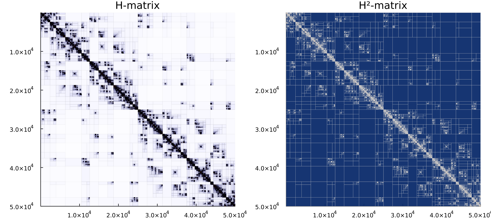

# H2Matrices.jl

_A package for assembling and factoring H²-matrices (hierarchical matrices with nested bases)._

## Installation

```julia
using Pkg
Pkg.add(url="https://github.com/IntegralEquations/HMatrices.jl")
Pkg.add(url="https://github.com/duserzym/H2Matrices.jl")
```

## Overview

This package provides functionality for assembling, compressing, and performing
linear algebra with
[H²-matrices](https://en.wikipedia.org/wiki/Hierarchical_matrix) — hierarchical
matrices that exploit **shared nested bases** to achieve `O(N)` storage and
matrix–vector product cost.  It builds on
[HMatrices.jl](https://github.com/WaveProp/HMatrices.jl) for cluster trees,
kernel matrices, and ACA.

For the purpose of illustration, let us consider an abstract matrix `K` with
entry `i,j` given by the evaluation of some _kernel function_ `G` on points
`X[i]` and `Y[j]`, where `X` and `Y` are vectors of points (in 3D here); that
is, `K[i,j] = G(X[i], Y[j])`.  This object can be constructed as follows:

```julia
using H2Matrices
using HMatrices: KernelMatrix, ClusterTree, GeometricSplitter,
    assemble_hmatrix, compression_ratio
using StaticArrays, LinearAlgebra
using Plots

const Point3D = SVector{3,Float64}

# sample some points on a sphere
m = 50_000
X = Y = [Point3D(sin(θ)cos(ϕ), sin(θ)*sin(ϕ), cos(θ))
         for (θ,ϕ) in zip(π*rand(m), 2π*rand(m))]

function G(x, y)
    d = norm(x - y) + 1e-8
    1 / (4π * d)
end

K = KernelMatrix(G, X, Y)
```

where we took `G` to be the free-space Green's function of Laplace's equation
in 3D (to avoid division-by-zero we added `1e-8` to the distance between
points).

The object `K` corresponds to a dense matrix, so converting it to a matrix can
be costly both in terms of memory and flops.  Instead, we can construct an
approximation to `K` as a hierarchical matrix using
[HMatrices.jl](https://github.com/WaveProp/HMatrices.jl), and then build an
H²-matrix from the same kernel:

```julia
# H-matrix (for comparison)
H = assemble_hmatrix(K; atol=1e-6)

# H²-matrix via Chebyshev interpolation
h2 = assemble_h2matrix(K; order=4)
```

We can now use `H` and `h2` as approximations to `K` for matrix–vector
products:

```julia
x = rand(m)
y_h  = H * x
y_h2 = h2 * x
```

To check that these are indeed good approximations, compare against the exact
value at a given entry:

```julia
exact_42 = sum(K[42,j]*x[j] for j in 1:m)

println("H-matrix  absolute error at index 42: ", abs(y_h[42]  - exact_42))
println("H²-matrix absolute error at index 42: ", abs(y_h2[42] - exact_42))
```

```
H-matrix  absolute error at index 42: ≈ 2e-7
H²-matrix absolute error at index 42: ≈ 5e-4
```

> **Tip**: You can visualize the underlying block structure using Plots.jl
> recipes included in this package:
>
> ```julia
> plot(
>     plot(H;  title="H-matrix"),
>     plot(h2; title="H²-matrix");
>     layout=(1,2), size=(1000, 450)
> )
> ```
>
> which produces:
>
> 
>
> Admissible (low-rank) blocks are shown in blue, dense (near-field) blocks in
> gold.  Darker shading indicates denser blocks.

## Key Features

- **Chebyshev interpolation assembly** — build an H²-matrix directly from a
  kernel function using tensor-product Chebyshev interpolation.
- **Adaptive ACA-based assembly** — construct an H-matrix with ACA, then
  convert to H² format with shared nested bases.
- **O(N) matrix–vector product** — three-phase algorithm (forward transform →
  coupling → backward transform + near-field).
- **Recompression** — reduce basis ranks of an existing H²-matrix while
  controlling approximation error.
- **Built on [HMatrices.jl](https://github.com/WaveProp/HMatrices.jl)** —
  leverages its cluster trees, admissibility conditions, and ACA.
- **Appropriate application domains** — ideal for large dense matrices arising from non-local
  operators, e.g. integral equations, kernel methods, covariance matrices. Based on my testing, it is most effective for matrices of size `N > 10_000` (depending on the kernel and desired accuracy).


## Documentation

For more information, see the
[documentation](docs/src/index.md) and the
[examples](docs/src/examples.md).

## References

- Hackbusch, Wolfgang. *Hierarchical matrices: algorithms and analysis.* Vol. 49. Heidelberg: Springer, 2015.
- Börm, Steffen. *Efficient numerical methods for non-local operators.* EMS, 2010.
- Hackbusch, W., Khoromskij, B., & Sauter, S. A. (2000). On H2-Matrices. In H.-J. Bungartz, R. H. W. Hoppe, & C. Zenger (Eds.), Lectures on Applied Mathematics (pp. 9–29). Springer. https://doi.org/10.1007/978-3-642-59709-1_2
- HMatrices.jl: https://github.com/IntegralEquations/HMatrices.jl
- H2Lib: https://github.com/H2Lib/H2Lib
