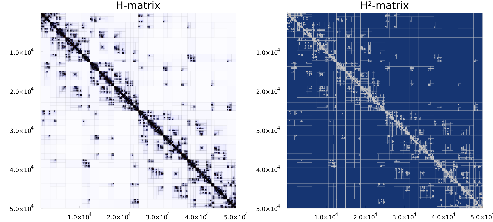

# H2Matrices.jl

[](https://doi.org/10.5281/zenodo.21748179)

_A package for assembling and factoring H²-matrices (hierarchical matrices with nested bases)._

So far this package is completely vibed out with AI agents, by feeding the HMatrices.jl library and the H2Lib C library as references. Please feel free to test and use with caution.

## Installation

```julia
using Pkg
Pkg.add(url="https://github.com/duserzym/H2Matrices.jl", rev="v0.1.3")
```

## Overview

This package provides functionality for assembling, compressing, and performing
linear algebra with
[H²-matrices](https://en.wikipedia.org/wiki/Hierarchical_matrix) — hierarchical
matrices that exploit **shared nested bases** to achieve `O(N)` storage and
matrix–vector product cost.  It builds on
[HMatrices.jl](https://github.com/WaveProp/HMatrices.jl) for cluster trees,
kernel matrices, and ACA.

The recent accuracy-preserving improvements are documented in detail on the
website: [algorithmic causes and changes](https://duserzym.github.io/H2Matrices.jl/stable/advances/),
[practical configuration](https://duserzym.github.io/H2Matrices.jl/stable/accuracy_performance/),
and [real-grain validation with downloadable data](https://duserzym.github.io/H2Matrices.jl/stable/validation/).
The explanation covers inherited interactions, ACA factor weighting, stored
adjoints, rank caps, implicit saturated bases, packet products and safe concurrency.
The selected PLAG066 plan retains the original compression tolerances; the
separate 244 MB relaxed-tolerance experiment is documented as an accuracy tradeoff.

For the purpose of illustration, let us consider an abstract matrix `K` with
entry `i,j` given by the evaluation of some _kernel function_ `G` on points
`X[i]` and `Y[j]`, where `X` and `Y` are vectors of points (in 3D here); that
is, `K[i,j] = G(X[i], Y[j])`.  This object can be constructed as follows:

```julia
using H2Matrices
using HMatrices: KernelMatrix, ClusterTree, GeometricSplitter, assemble_hmatrix
using StaticArrays, LinearAlgebra
using Plots

const Point3D = SVector{3,Float64}

# sample some points on a sphere
m = 50_000
X = Y = [Point3D(sin(θ)cos(ϕ), sin(θ)*sin(ϕ), cos(θ))
         for (θ,ϕ) in zip(π*rand(m), 2π*rand(m))]

function G(x, y)
    d = norm(x - y) + 1e-8
    1 / (4π * d)
end

K = KernelMatrix(G, X, Y)
```

where we took `G` to be the free-space Green's function of Laplace's equation
in 3D (to avoid division-by-zero we added `1e-8` to the distance between
points).

The object `K` corresponds to a dense matrix, so converting it to a matrix can
be costly both in terms of memory and flops.  Instead, we can construct an
approximation to `K` as a hierarchical matrix using
[HMatrices.jl](https://github.com/WaveProp/HMatrices.jl), and then build an
H²-matrix from the same kernel:

```julia
# H-matrix (for comparison)
H = assemble_hmatrix(K; atol=1e-6)

# H²-matrix via Chebyshev interpolation
h2 = assemble_h2matrix(K; order=4)
```

We can now use `H` and `h2` as approximations to `K` for matrix–vector
products:

```julia
x = rand(m)
y_h  = H * x
y_h2 = h2 * x
```

For small problems you can compare against a dense reference. For large problems,
sample a few entries or matvecs:

```julia
sample = 42
exact_sample = sum(K[sample,j] * x[j] for j in 1:m)

println("H-matrix  sampled entry error: ", abs(y_h[sample]  - exact_sample))
println("H²-matrix sampled entry error: ", abs(y_h2[sample] - exact_sample))
println("H² summary: ", H2Matrices.compression_summary(h2))
```

```
H-matrix  sampled entry error: ≈ 2e-7
H²-matrix sampled entry error: ≈ 5e-4
```

> **Tip**: You can visualize the underlying block structure using Plots.jl
> recipes included in this package:
>
> ```julia
> plot(
>     plot(H;  title="H-matrix"),
>     plot(h2; title="H²-matrix");
>     layout=(1,2), size=(1000, 450)
> )
> ```
>
> which produces:
>
> 
>
> Admissible blocks are colored by rank: darker blue means lower rank, brighter
> gold means higher rank. Dense near-field blocks are shown in orange.

## Key Features

- **Chebyshev interpolation assembly** — build an H²-matrix directly from a
  kernel function using tensor-product Chebyshev interpolation.
- **Adaptive ACA-based assembly** — construct an H-matrix with ACA, then
  convert to H² format with shared nested bases.
- **O(N) matrix–vector product** — three-phase algorithm (forward transform →
  coupling → backward transform + near-field).
- **Recompression** — reduce basis ranks of an existing H²-matrix while
  controlling approximation error.
- **Diagnostics** — summarize storage, block counts, ranks, and sampled
  approximation errors.
- **Solver wrappers** — CG and restarted GMRES operate directly on compressed
  H² matrices through `mul!`.
- **Built on [HMatrices.jl](https://github.com/WaveProp/HMatrices.jl)** —
  leverages its cluster trees, admissibility conditions, and ACA.
- **Appropriate application domains** — ideal for large dense matrices arising from non-local
  operators, e.g. integral equations, kernel methods, covariance matrices. Based on my testing, it is most effective for matrices of size `N > 10_000` (depending on the kernel and desired accuracy).


## Accuracy and adjoints

Adaptive conversion preserves direct and inherited far-field interactions in
partner-QR-weighted nested bases. Unused parent bases have rank zero. Use
`strict=true` to reject a rank cap that prevents the requested local SVD
accuracy, and control initial ACA accuracy separately with `aca_rtol`:

```julia
h2 = assemble_h2matrix_adaptive(K; rtol=1e-9, aca_rtol=1e-10,
                                maxrank=120, strict=true)
y = h2 * x
z = adjoint(h2) * y
```

`adjoint(h2)` and `transpose(h2)` apply the exact transpose of the stored real
approximation. They reuse the existing bases and numerical blocks, including
independent row and column permutations and rectangular matrices.

The basis tolerance is local; it does not certify the total operator, field,
or solver error. Validate against a trusted reference at the accuracy required
by the application. Adaptive assembly still builds an H-matrix first, so peak
construction memory is larger than final H2 storage.

## Reusable matvec plans and recompression

```julia
plan = H2MatvecPlan(h2)
mul!(y, plan, x)
mul!(z, adjoint(plan), y)

recompress!(h2; rtol=1e-8, maxrank=512, strict=true)
plan = H2MatvecPlan(h2) # rebuild after changing the matrix
```

Plans flatten tree traversal, cache index permutations, and reuse coefficient
and vector buffers. Their numerical blocks are shared with `h2`, so they do
not duplicate the operator. Each concurrent worker needs its own plan; a
single plan must not be used concurrently. Neither source bases nor blocks
should be mutated while a plan is in use.

Strict recompression rejects insufficient rank caps and leaves the original
unchanged on failure. It uses a temporary copy, increasing peak setup memory.
It visits active descendants even when their parent has rank zero.

`H2LowRankMatvecPlan(h2; rtol=1e-10)` is an experimental matvec-only alternative
that stores selected coupling matrices as SVD factors when those factors use
less numeric storage. It retains bases and near-field blocks without retaining
the original operator or discarded couplings. `storage_bytes(plan)` reports
its numeric matrix storage, excluding scratch buffers and object overhead.
The coupling tolerance introduces another local approximation and needs
application-level validation; reduced storage does not guarantee faster
products. Its adjoint uses exactly the same stored factors. It also requires
one plan per worker and immutable shared numerical data.

## Compact and packet plans (v0.1.1)

```julia
using LinearAlgebra
BLAS.set_num_threads(1)

compact = H2CompactMatvecPlan(h2)       # no extra truncation
plan = H2PacketMatvecPlan(h2; workers=4)
mul!(y, plan, x)
mul!(z, adjoint(plan), y)
worker_plan = copy(plan)               # shared matrices, independent scratch
```

The compact plan replaces saturated cluster bases with implicit identity
bases and moves their numerical action into couplings and parent transfers.
It works with nonorthogonal and overcomplete bases. This changes the stored
representation up to floating-point rounding, without relaxing tolerances.
The packet plan groups interactions into contiguous matrices and supports
parallel execution with private transpose buffers and fixed reduction order.
Overlapping near-field row ranges use a safe serial forward fallback.

`workers=1` is the default and supports allocation-free warmed products on
recent Julia compilers. Threaded plans allocate small task-scheduling objects.
Always use one plan per concurrent caller: `copy(plan)` shares numerical data
while copying all mutable scratch. Do not mutate shared numerical matrices
or plan metadata while workers are active. Plans are matvec-only operators.

On the real PLAG066 campaign grain (19,901 nodes, 100,602 tetrahedra, 6,028
boundary nodes), the four-worker packet plan retained the original basis
and ACA tolerances (`1e-10` and `1e-11`) while using 302.75 MB of numeric
storage versus 337.78 MB for H2 and 378.59 MB for H. NEB polishing took
52.2 s versus 53.9 s for H in paired single runs. Newly generated LEM/NEB
states differed from H by at most 5.5e-11 T in tangent torque. These results
are specific to this grain and path, not a general performance guarantee.
Construction still uses a temporary H matrix; final storage is not peak RSS.

For the unregistered package, install a reproducible release with:

```julia
using Pkg
Pkg.add(url="https://github.com/duserzym/H2Matrices.jl", rev="v0.1.3")
```

## Documentation

For more information, see the
[documentation](docs/src/index.md) and the
[examples](docs/src/examples.md).

The current development plan is tracked in [ROADMAP.md](ROADMAP.md).

## References

- Hackbusch, Wolfgang. *Hierarchical matrices: algorithms and analysis.* Vol. 49. Heidelberg: Springer, 2015.
- Börm, Steffen. *Efficient numerical methods for non-local operators.* EMS, 2010.
- Hackbusch, W., Khoromskij, B., & Sauter, S. A. (2000). On H2-Matrices. In H.-J. Bungartz, R. H. W. Hoppe, & C. Zenger (Eds.), Lectures on Applied Mathematics (pp. 9–29). Springer. https://doi.org/10.1007/978-3-642-59709-1_2
- HMatrices.jl: https://github.com/IntegralEquations/HMatrices.jl
- H2Lib: https://github.com/H2Lib/H2Lib

Julia 1.13 or later is required. CI tracks the latest stable Julia release.
