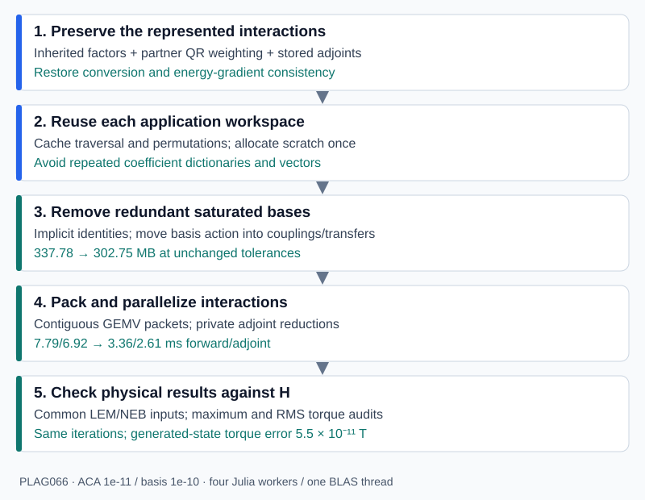

# How accuracy, memory and speed improved

The v0.1.1 numerical changes addressed two separate problems: lost information during nested compression, and unnecessary storage and work when applying the corrected operator. v0.1.2 keeps that implementation and requires Julia 1.13 or later. Raising the Julia requirement is a maintenance decision; the measured performance gains come from the representation and matvec changes described here.



The [PLAG066 validation](validation.md) provides the measured evidence. The [practical guide](accuracy_performance.md) shows how to use these APIs.

## Why a small compression tolerance was insufficient

An H-matrix represents each admissible block independently:

```math
H_{\tau\sigma}=A_{\tau\sigma}B_{\tau\sigma}^{\mathsf T}.
```

H² conversion replaces these independent factors by shared row and column bases, with a coupling for each block:

```math
\widetilde H_{\tau\sigma}=V_\tau S_{\tau\sigma}W_\sigma^{\mathsf T}.
```

A child basis must represent the restrictions of interactions belonging to its ancestors as well as its own interactions. A locally accurate SVD of an incomplete collection of columns cannot preserve a direction that was never supplied to it. This explains why reducing `rtol` alone did not resolve the observed convergence discrepancy.

### Preserve inherited interactions at every level

The earlier internal-basis construction projected a node's direct interaction factors but did not consistently include inherited factors when the node also had direct interactions. The corrected construction combines both collections before projection and SVD.

For a concrete example, suppose an ancestor interaction needs the constant vector on a child cluster, while that child's own interaction needs an alternating-sign vector. Keeping only the child's direct interaction can discard the constant direction even with a tiny local tolerance. The regression test supplies these two directions explicitly and verifies that the child's reconstructed basis retains both.

Nesting is implemented through child transfers:

```math
V_\tau=
\begin{pmatrix}V_{\tau_1}&0\\0&V_{\tau_2}\end{pmatrix}
\begin{pmatrix}E_{\tau_1}\\E_{\tau_2}\end{pmatrix}.
```

Projection uses recursive nested compression rather than repeatedly materializing every full internal basis. That reduces temporary work while retaining the same projection.

### Weight factors by the partner's QR factor

The magnitude of an ACA factor column alone does not measure the importance of its block contribution. Rescaling one rank-one term by

```math
A_{:j}\leftarrow cA_{:j},\qquad B_{:j}\leftarrow B_{:j}/c
```

leaves the block unchanged, but changes an unweighted SVD of the columns of `A`. For row-basis construction, write the partner factor as

```math
B=Q_B R_B,\qquad AB^{\mathsf T}=(AR_B^{\mathsf T})Q_B^{\mathsf T}.
```

The weighted factor `A * R_B'` measures the block through an orthonormal partner. Column construction similarly uses `B * R_A'`. This removes the artificial dependence of the local importance measure on arbitrary ACA factor scaling, up to floating-point effects. A regression rescales ACA factor columns by reciprocal factors of `1e6` and `1e-6`, then checks the represented matrix and conversion accuracy.

### Avoid unused parent bases

A parent with no direct or inherited far-field interactions does not need a basis merely because its children have their own local interactions. The corrected construction gives such a parent rank zero, while retaining the children's active bases and couplings. This avoids large identity embeddings that previously stored directions with no parent-level use.

A zero-rank parent is not an empty subtree. Recompression now traverses its descendants. Otherwise, the corrected zero-rank root could cause an entire active tree to be skipped.

## Make the gradient differentiate the stored energy

Accuracy of the forward product and consistency of the energy derivative are separate requirements. Merrill previously could assemble a separately compressed transposed kernel. That second approximation need not equal the transpose of the stored forward operator.

The package now applies `transpose(h2)` and `adjoint(h2)` using the original bases, transfers, couplings and near-field blocks, reversing the product. For the current real-valued representation, each coupling uses its stored transpose. Rectangular shapes and distinct row/column permutations are respected.

The defining check is

```math
z^{\mathsf T}(\widetilde Hx)
=(\widetilde H^{\mathsf T}z)^{\mathsf T}x.
```

As a simple illustration, the derivative of the stored quadratic energy `E(x) = x' * B * x / 2` is `(B + B') * x / 2`. Replacing `B'` with an independently approximated operator changes that derivative. The actual FEM/BEM energy includes additional maps and solves, whose adjoints must likewise use the stored forward components.

Merrill's integration uses a lazy adjoint of the same H² operator. This also avoids retaining a second independently assembled boundary operator. This consistency improvement is distinct from the 337.78-to-302.75 MB single-operator storage comparison below.

## Make rank caps explicit

`rtol` controls local singular-value truncation; `maxrank` limits the retained rank. If the cap forces removal of a singular value above the requested relative threshold, the implementation reports it. With `strict=true`, assembly/conversion rejects that cap.

Strict recompression performs the operation on a temporary copy and leaves the original operator unchanged if the cap is inadequate. This protects a previously validated operator, at the cost of additional setup memory. Successful recompression requires rebuilding any existing matvec plans.

These checks do not certify a global operator error. ACA error, nested truncations, cancellation, physical weighting and solver sensitivity still require reference comparisons. PLAG066 reached row/column ranks 406/401 in the original tight-tolerance representation; the default cap 120 was not validated for that grain.

## Reuse the work of applying the operator

`H2MatvecPlan` caches permutations, flattens the traversal metadata, and allocates coefficient and physical-vector scratch once. Repeated products reuse that scratch. The upward transform, coupling interactions, downward transform and near-field product still apply the same stored matrix.

This removes the repeated temporary dictionaries and vector allocations of the generic tree-based path. In the recorded PLAG066 run, raw H² products allocated approximately 0.85 MB forward and 1.06 MB adjoint per call. The warmed reusable baseline allocated zero bytes on the measured compiler, before any new compact representation was introduced.

One plan owns mutable scratch. A caller must use `copy(plan)` for each concurrent application; copying shares the numerical matrices and creates independent coefficient, vector and coupling scratch.

## Remove redundant saturated bases algebraically

At very tight tolerances, a basis can have represented rank `k` at least as large as its cluster's physical size `n`. Storing an `n × k` basis provides little compression, even though the basis may be nonorthogonal or rank-deficient.

`H2CompactMatvecPlan` replaces such a basis by an implicit physical-coordinate identity. Let `U` be the original fully expanded basis at a saturated row cluster and `W` the original basis at a saturated column cluster. The block is preserved by

```math
USW^{\mathsf T}=I_n\,(USW^{\mathsf T})\,I_m^{\mathsf T}.
```

If only the row is replaced, its coupling becomes `U * S`; if only the column is replaced, it becomes `S * W'`. A replaced child's transfer to an unreplaced parent becomes `U_child * E_child`. A replaced parent's contribution expands directly into physical output, so its old child transfers are unnecessary. Child-local interactions remain active.

The identity basis is never stored as a dense identity matrix: the upward pass copies physical values and the downward pass adds them directly. No singular values are discarded and no orthogonality assumption is needed. Only floating-point rounding is introduced. Tests cover nonorthogonal and overcomplete interpolation bases as well as adaptive bases.

For the selected PLAG066 operator, 539 row nodes and 537 column nodes use implicit identity bases. Numeric storage falls from 337,784,464 to 302,752,824 bytes at the same ACA/basis tolerances. This saving is a property of the tested operator's saturated bases, not a universal percentage for H² matrices.

## Pack interactions into larger contiguous products

Many small coupling products have call, indexing and memory-access overhead. `H2PacketMatvecPlan` groups couplings sharing a row coefficient range:

```math
\widehat y_\tau\mathrel{+}=
\begin{bmatrix}S_{\tau\sigma_1}&S_{\tau\sigma_2}&\cdots\end{bmatrix}
\begin{pmatrix}\widehat x_{\sigma_1}\\\widehat x_{\sigma_2}\\\vdots\end{pmatrix}.
```

Packing does not truncate matrix entries; it changes evaluation and accumulation order. In v0.1.3 the selected operator contained 263 coupling packets and 448 near-field packets, applied by BLAS GEMV after gathering inputs into scratch. A one-worker packet plan improved the forward/adjoint medians from 7.79/6.92 ms for the reusable baseline to 6.27/5.50 ms.

The unreleased packet layout keeps couplings as row packets, but stores the near field as *column packets*: every dense block is split at the elementary column intervals defined by all near-field column ranges, and all pieces of one interval are stacked vertically,

```math
Q_e=\begin{bmatrix}D_{\tau_1 e}\\ D_{\tau_2 e}\\ \vdots\end{bmatrix}.
```

Each packet is then applied by a single long-column kernel in both directions, so the near field and the couplings need no dot products over very short columns (a 32-row near-field leaf block applied transposed ran at about 13-25 GB/s on one core, versus 60-70 GB/s for long columns); the upward pass still applies transposed transfer matrices whose columns have the child rank as length. Fused kernels read input segments in place instead of gathering them and replace BLAS GEMV. On the same packets the fused loops were measured at about 66-70 GB/s against 53-60 GB/s for GEMV; the gap depends on packet shape and run.

## Parallelize with explicit ownership of writes

A product runs three phases of independent tasks:

1. upward pass, one task per coefficient-bearing subtree of the input tree, together with the near-field packets, which need no basis coefficients;
2. coupling packets, one task per packet;
3. slot reduction and downward pass, one task per coefficient-bearing subtree of the output tree.

Subtrees rooted at the highest nodes with nonempty coefficients have disjoint coefficient and physical index ranges. Among the packet tasks, a forward coupling packet owns its row coefficient range and a transposed near-field packet owns its column interval. The other two cases write private *slots*: the transposed coupling packet writes `M' * x̂_τ` and the forward near-field packet writes `Q_e * x_e`. The output subtree that owns each destination range adds the slots in fixed order, immediately before its downward pass. Near-field rows are split at subtree boundaries for this purpose.

No two tasks of a phase write the same entry, so no worker reduction buffers are needed. Tasks are claimed dynamically from a cost-descending list. Each task has a fixed evaluation order, so products are bitwise independent of the worker count and of the task assignment; this is tested. The earlier serial forward near-field fallback and per-worker transpose reductions are gone. The forward near field, which overlapped in rows across tree levels, and the upward and downward passes all run in parallel.

Forward products also start the downward pass of a row subtree as soon as its last coupling packet completes: the worker that completes it runs the pass at once, without waiting, so forward products need two task regions.

With four workers and one BLAS thread, forward/adjoint medians against the v0.1.3 packet plan in the same process were:

| Grain (boundary nodes) | Stored MB | v0.1.3 packet, ms | Current packet, ms |
|---|---:|---:|---:|
| PLAG066 (6,028) | 302.75 | 3.42 / 2.75 | 1.83 / 1.62 |
| PLAG036 (12,415) | 714.85 | 9.46 / 8.02 | 5.01 / 4.71 |
| PLAG022 (17,875) | 1,511.48 | 19.41 / 18.51 | 10.72 / 9.63 |

The machine was shared during these runs, so absolute times varied by about 10%. Both plans store the same numeric data. Products differ from the v0.1.3 plan by at most 8.4e-16 relative, and errors against dense products are unchanged. Single-vector products are close to memory-bandwidth bound: with four workers, a product took 1.1-1.2 times as long as reading every stored matrix once. Adding workers therefore helped little beyond 6-8 on a 10+4-core M4 Pro. Threaded products allocate small task-scheduling objects (5-8 KB per call with four workers); one-worker plans do not allocate.

## Apply several right-hand sides at once

`mul!(Y, plan, X)` and `mul!(Y, adjoint(plan), X)` with matrices run the same phases on column-major blocks of up to 16 vectors. Register-blocked kernels reuse each packet column from cache for four vectors at a time, so the operator is streamed once per block. With four workers, the time per vector at `k = 9` was 0.6-0.7/0.6 ms forward/adjoint on PLAG066 (single products: 1.8/1.6 ms), 1.5/1.6 ms on PLAG036 and 3.1/2.9 ms on PLAG022. Multi-vector products are compute-bound rather than bandwidth-bound, so they keep scaling with workers: with eight workers on PLAG066 the time was 0.43/0.32 ms per vector. Results agree with column-wise products up to about 5e-16 relative. The workspace is allocated on first use and kept by the plan; `multi_workspace_bytes(plan, k)` reports its size (20, 43 and 67 MB for `k = 9` on the three grains) and `release_multi_workspace!(plan)` frees it.

## Separate representation changes from new approximations

The selected tight-tolerance plan uses `coupling_rtol=nothing`. Reusable scratch, implicit identities and packet packing do not add a truncation tolerance.

`H2LowRankMatvecPlan`, optional compact-plan coupling SVD, relaxed basis tolerances and recompression can reduce storage further, but change the approximation. An earlier 244.40 MB candidate used basis tolerance `1e-7` and had screened torque discrepancy about `3.46e-7 T`. It passed that experiment's `1e-6 T` gate, but does not meet the later `1e-9 T` gate. The 303 MB result retains basis tolerance `1e-10`.

The current packet constructor materializes factorized couplings when packing them. Combining SVD coupling compression with packets can therefore give up the factorized storage benefit, even though the stored approximation is retained.

## Implementation and background

The numerical changes were released in [v0.1.1](https://github.com/duserzym/H2Matrices.jl/releases/tag/v0.1.1); [v0.1.2](https://github.com/duserzym/H2Matrices.jl/releases/tag/v0.1.2) changes the Julia requirement. Source files describe [nested conversion and recompression](https://github.com/duserzym/H2Matrices.jl/blob/v0.1.2/src/compression.jl), [reusable products](https://github.com/duserzym/H2Matrices.jl/blob/v0.1.2/src/matvec_plan.jl), [compact bases](https://github.com/duserzym/H2Matrices.jl/blob/v0.1.2/src/compact_plan.jl), and [packet execution](https://github.com/duserzym/H2Matrices.jl/blob/v0.1.2/src/packet_plan.jl).

For the broader micromagnetic motivation, see Hertel, Christophersen and Börm, [*Large-scale magnetostatic field calculation in finite element micromagnetics with H2-matrices*](https://arxiv.org/abs/1811.05731). [H2Lib's compression source](https://github.com/H2Lib/H2Lib/blob/master/Library/h2compression.c) is an implementation reference for nested-basis recompression. The accuracy and performance claims on these pages come from this package's tests and PLAG066 measurements, not from assuming the published results transfer to this implementation.
