# Examples

These examples are meant to answer three practical questions:

1. How do I assemble an H² approximation of a kernel matrix?
2. How do I measure whether the approximation is accurate enough?
3. How do I use the compressed operator in a solver without materializing the
   dense matrix?

For small examples we form a dense reference matrix so the error numbers are
easy to audit. For large examples, prefer sampled entry checks or sampled
matvec checks with [`relative_matvec_error`](@ref) and
[`sampled_frobenius_error`](@ref).

## How to Read These Examples

An H²-matrix is still just a matrix. The difference is that we never want to
store all of its entries when the matrix is large.

In these examples, the dense matrix would have entries

```math
K_{ij} = G(x_i, y_j),
```

where:

- ``x_i`` is the point associated with row ``i``.
- ``y_j`` is the point associated with column ``j``.
- ``G`` is the kernel that tells us how strongly point ``y_j`` affects point
  ``x_i``.
- A matrix-vector product ``u = K q`` means: given source strengths ``q_j``,
  accumulate the field or potential ``u_i`` at every target point.

The package does not need the full dense matrix. It needs:

1. **Point coordinates** so it can decide which groups of rows and columns are
   geometrically close or far apart.
2. **A kernel function** so it can evaluate individual entries when needed.
3. **Cluster trees** so it can organize the points into boxes at multiple
   scales.
4. **An admissibility rule** so close interactions stay exact/dense and far
   interactions are compressed.

For micromagnetics, the closest analogy is the boundary-element part of the
demagnetizing-field calculation. Boundary nodes interact nonlocally through a
smooth Green's-function-like operator. That boundary-to-boundary matrix is dense
if stored directly, but its far-field blocks are compressible. Local FEM
operators such as exchange, anisotropy, and Zeeman terms are different: they are
sparse or pointwise/local and are better handled as sparse or matrix-free
operators rather than H² matrices.

!!! note "Dense references are teaching tools"
    Several examples below build `K_dense` to measure the approximation error.
    That is only appropriate for small examples. In production, the whole point
    is to keep the operator compressed and validate with sampled entries,
    sampled matvecs, or physics-specific regression tests.

## Visualizing Matrix Compression

To build intuition, let's start with a visual overview of how H-matrices and
H²-matrices compress a dense kernel matrix.

Consider ``N = 500`` points randomly distributed in the unit square, with the
2D Laplace kernel ``G(x,y) = 1/(4\pi\|x-y\|)``:

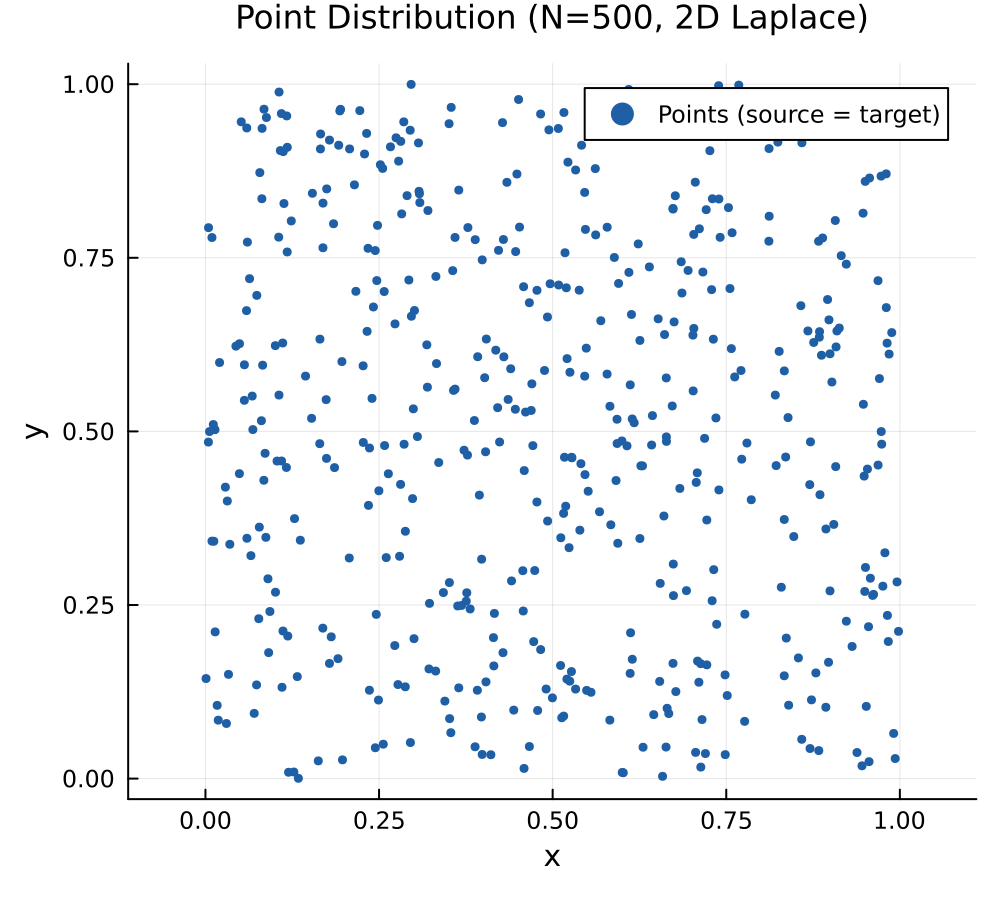

The full kernel matrix is ``500 \times 500`` and dense:

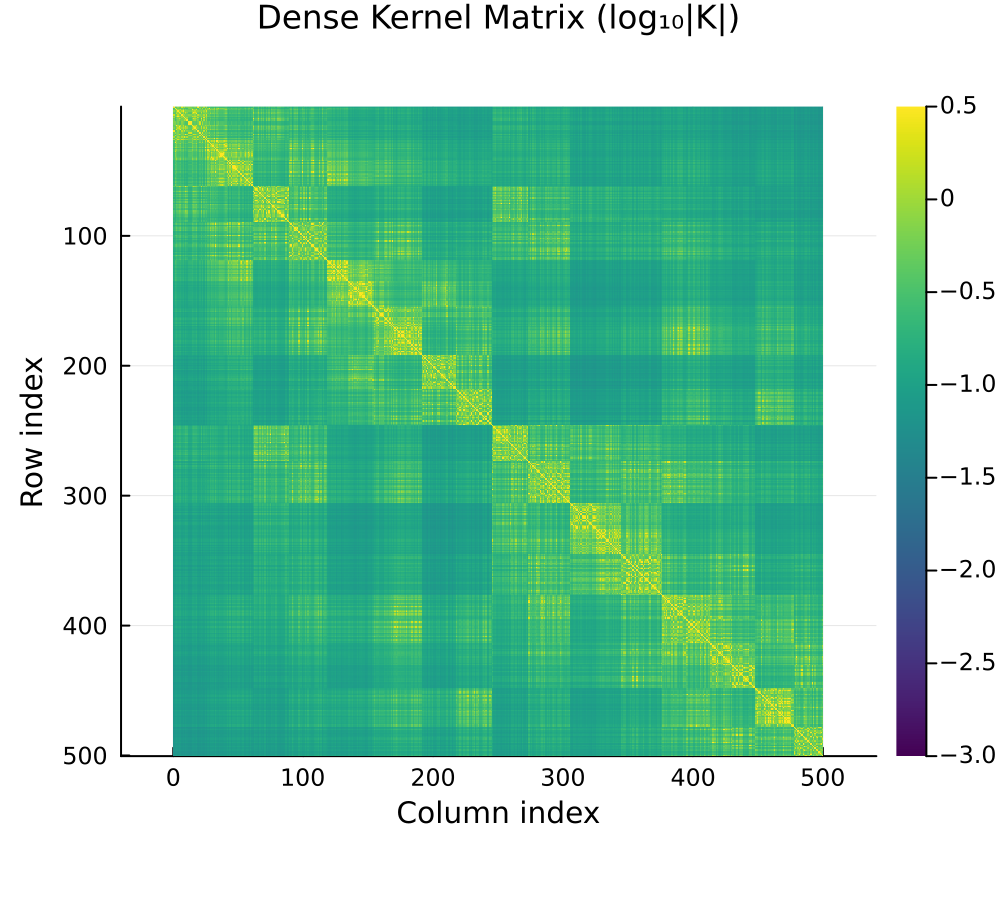

### H-Matrix vs H²-Matrix Block Structure

Both H-matrices and H²-matrices decompose this into a hierarchy of blocks.
Near-field (close-together) blocks are stored as dense matrices (orange), while
far-field blocks are compressed:

- **H-matrix**: each admissible block stores its own independent low-rank
  factors.
- **H²-matrix**: admissible blocks share nested cluster bases, storing only
  small coupling matrices.

In the block plots, low-rank admissible blocks are dark blue and higher-rank
admissible blocks move toward bright gold. Dense near-field blocks are orange.

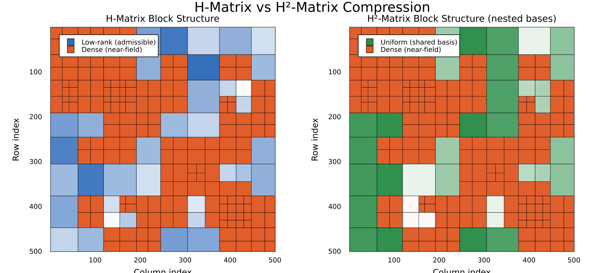

The block structure is identical — the difference is in how the low-rank data is
stored.  H²-matrices achieve ``O(N)`` storage by sharing bases across blocks at
the same tree level.

!!! note
    Compression ratios reported by H2Matrices.jl include row and column cluster
    bases, not only leaf dense blocks and coupling matrices. Small examples may
    have ratios below one because setup overhead dominates; the asymptotic
    advantage appears as the geometry grows.

### Approximation Error

The error distribution reveals where each method is accurate.  Dense (near-field)
blocks are exact (black = machine zero), while far-field blocks carry
approximation error:

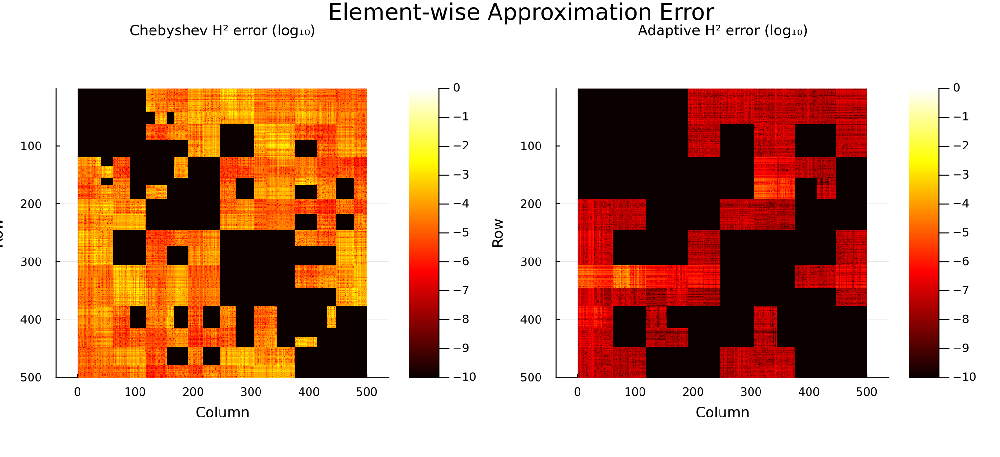

The adaptive method (right) achieves much lower error in the far-field blocks
because the ranks adapt to the actual kernel smoothness, rather than using a
fixed Chebyshev order.

### Recompression

Starting from a Chebyshev H²-matrix with conservative order-5 interpolation
(total basis rank = 1075), recompression with ``\text{rtol} = 10^{-4}`` reduces
ranks while preserving accuracy:

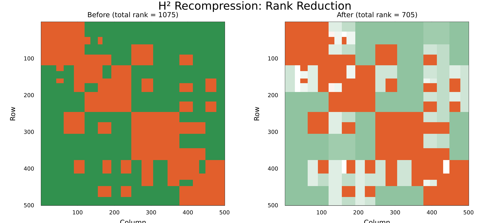

Lighter green blocks have lower rank after recompression — the algorithm
automatically identifies which blocks need less precision.

---

## Example 1: 2D Laplace Kernel

The Laplace Green's function in 2D (really the free-space fundamental solution
in the plane) is one of the most common kernels in potential theory:

```math
G(x, y) = \frac{1}{4\pi \|x - y\|}
```

This example compares Chebyshev and adaptive assembly, and demonstrates
recompression.

```julia
using H2Matrices
using HMatrices: KernelMatrix, ClusterTree, GeometricSplitter
using StaticArrays, LinearAlgebra, Random

Random.seed!(42)

# --- Setup ---
N = 300

# Rows and columns of the matrix are represented by point coordinates.
# Here the two point clouds are deliberately separated in x so that many
# row/column cluster pairs are far enough apart to be compressed.
src = [SVector{2,Float64}(rand(), rand()) for _ in 1:N]
tgt = [SVector{2,Float64}(2.0 + rand(), rand()) for _ in 1:N]

# This object behaves like a dense matrix whose entry (i,j) is obtained by
# evaluating the kernel at one row point and one column point. The entries are
# computed lazily; no N x N array is allocated here.
K = KernelMatrix(src, tgt) do x, y
    r = norm(x - y)
    r > 0 ? 1 / (4π * r) : 0.0
end

# ClusterTree reorders the point arrays in place, so pass a copy unless you
# intentionally want the original point order mutated.
Xclt = ClusterTree(deepcopy(src), GeometricSplitter(; nmax=30))
Yclt = ClusterTree(deepcopy(tgt), GeometricSplitter(; nmax=30))

# --- Dense reference (for error measurement) ---
# This block is here only because N is small. It gives us a ground-truth matvec.
K_dense = Matrix{Float64}(undef, N, N)
for j in 1:N, i in 1:N
    K_dense[i, j] = K[i, j]
end
x = randn(N)
y_ref = K_dense * x

# --- Method 1: Chebyshev interpolation ---
# Chebyshev assembly is deterministic. The order is per spatial dimension, so
# order=4 in 2D gives a nominal interpolation rank of 4^2 = 16 per cluster.
h2_cheb = assemble_h2matrix(K, Xclt, Yclt; order=4, global_index=true)
println("Chebyshev (order=4):  error = ", norm(h2_cheb * x - y_ref) / norm(y_ref))
println("  compression ratio = ", H2Matrices.compression_ratio(h2_cheb))

# --- Method 2: Adaptive ACA → H² ---
# Adaptive assembly first samples matrix entries to find low-rank structure,
# then converts the result to nested H² bases. This is often a better default
# when the effective rank is not obvious ahead of time.
h2_ada = assemble_h2matrix_adaptive(K, Xclt, Yclt; rtol=1e-6, maxrank=50)
println("Adaptive (rtol=1e-6): error = ", norm(h2_ada * x - y_ref) / norm(y_ref))
println("  compression ratio = ", H2Matrices.compression_ratio(h2_ada))
println("  rank summary = ", H2Matrices.rank_stats(h2_ada))

# --- Recompression ---
# Recompression is useful when the initial ranks are conservative. It reduces
# the nested bases and updates the coupling matrices in place.
h2_recomp = assemble_h2matrix(K, Xclt, Yclt; order=5, global_index=true)
rank_before = H2Matrices.total_rank(h2_recomp.row_basis)
recompress!(h2_recomp; rtol=1e-4, maxrank=50)
rank_after = H2Matrices.total_rank(h2_recomp.row_basis)
println("Recompressed: rank $rank_before → $rank_after, error = ",
    norm(h2_recomp * x - y_ref) / norm(y_ref))
```

**Output:**

```
Chebyshev (order=4):  error = 0.0017
  compression ratio = 352.0
Adaptive (rtol=1e-6): error = 1.54e-6
  compression ratio = 273.0
Recompressed: rank 775 → 118, error = 0.000402
```

The adaptive method achieves much better accuracy on this separated geometry.
Recompression reduces total basis rank while preserving sub-0.1% error. Treat
the exact printed values as representative rather than contractual: small
changes in BLAS, HMatrices.jl, or storage accounting can move them.

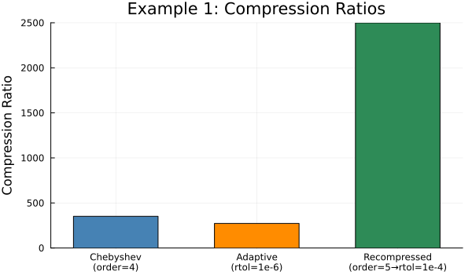
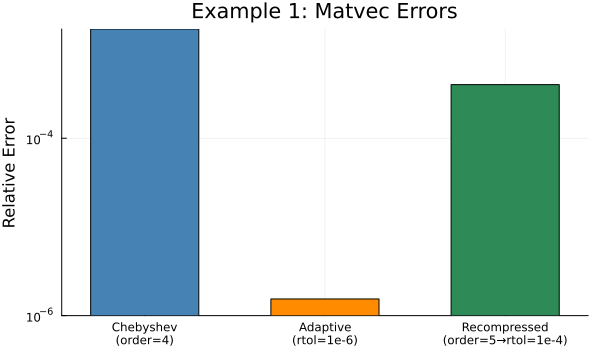

## Example 2: 3D Laplace Kernel

The same workflow extends to three dimensions, as needed for gravity,
electrostatics, and other potential-field kernels:

```julia
Random.seed!(123)

N = 200
src3 = [SVector{3,Float64}(rand(), rand(), rand()) for _ in 1:N]
tgt3 = [SVector{3,Float64}(3.0 + rand(), rand(), rand()) for _ in 1:N]

K3 = KernelMatrix(src3, tgt3) do x, y
    r = norm(x - y)
    r > 0 ? 1 / (4π * r) : 0.0
end

Xclt3 = ClusterTree(deepcopy(src3), GeometricSplitter(; nmax=20))
Yclt3 = ClusterTree(deepcopy(tgt3), GeometricSplitter(; nmax=20))

h2_3d = assemble_h2matrix(K3, Xclt3, Yclt3; order=3, global_index=true)

K3_dense = Matrix{Float64}(undef, N, N)
for j in 1:N, i in 1:N
    K3_dense[i, j] = K3[i, j]
end

x3 = randn(N)
println("3D Laplace (order=3): error = ",
    norm(h2_3d * x3 - K3_dense * x3) / norm(K3_dense * x3))
println("  compression ratio = ", H2Matrices.compression_ratio(h2_3d))
```

**Output:**

```
3D Laplace (order=3): error = 0.000788
  compression ratio = 54.9
```

The H²-matrix overlay on the exact matvec shows the approximation is nearly
indistinguishable:

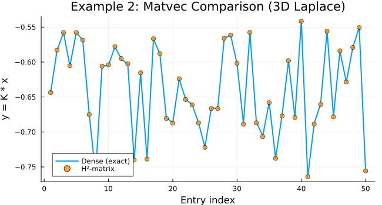

## Example 3: Adaptive Assembly with Automatic Tree Construction

For convenience, you can skip manual cluster tree construction:

```julia
Random.seed!(42)

N = 200
src = [SVector{2,Float64}(rand(), rand()) for _ in 1:N]
tgt = [SVector{2,Float64}(2.0 + rand(), rand()) for _ in 1:N]

K = KernelMatrix(src, tgt) do x, y
    r = norm(x - y)
    r > 0 ? 1 / (4π * r) : 0.0
end

# One-liner: builds trees, runs ACA, converts to H²
h2 = assemble_h2matrix_adaptive(K; rtol=1e-6, maxrank=50, nmax=32)

println("Size: ", size(h2))
x = randn(N)
y = h2 * x
println("Matvec computed with $(length(y)) entries")
println("Summary: ", H2Matrices.compression_summary(h2))
```

**Output:**

```
Size: (200, 200)
Matvec computed with 200 entries
Summary: (size = (200, 200), ..., compression_ratio = ...)
```

The source and target point sets for this example:

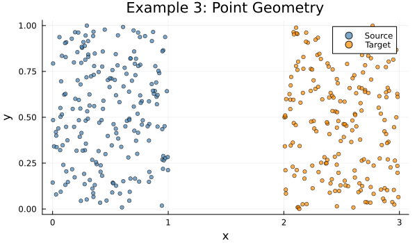

## Micromagnetics Interpretation

The examples above use scalar Laplace kernels because they are small, familiar,
and easy to check against dense references. A finite-element micromagnetics code
usually has a more structured operator split:

| Term | Mathematical character | Recommended representation |
|:-----|:-----------------------|:---------------------------|
| Demagnetizing BEM boundary coupling | nonlocal boundary-to-boundary interaction | H² matrix |
| Demagnetizing FEM volume operators | local finite-element gradient/divergence/stiffness operators | sparse or matrix-free |
| Exchange | local finite-element stiffness operator | sparse or matrix-free |
| Anisotropy | local nonlinear material law | direct local field evaluation |
| Zeeman | applied external field | direct vector contribution |

The H² part is most valuable for the dense boundary coupling. For example, in a
Fredkin-Koehler-style FEM/BEM demag calculation, one step has the form

```math
u_{\partial\Omega}^{(2)} = B_{\partial\Omega,\partial\Omega}
u_{\partial\Omega}^{(1)},
```

where ``B`` maps boundary potentials to boundary potentials. Stored densely,
``B`` costs ``O(N_b^2)`` memory. Stored as an H² matrix, the same operator can
often be applied in near-linear memory and time, while the surrounding FEM
operators remain local.

The implementation pattern is:

```julia
# Boundary coordinates define the row/column geometry.
boundary_points = [SVector{3,Float64}(coords[:, j]) for j in boundary_nodes]

# The kernel computes a single boundary interaction entry.
K_boundary = KernelMatrix(boundary_points, boundary_points) do x, y
    # Replace this toy expression with the actual boundary integral entry.
    r = norm(x - y)
    r > 0 ? 1 / (4π * r) : 0.0  # use the correct diagonal limit in real BEM code
end

# The compressed operator replaces a dense boundary matrix in mul!.
B_h2 = assemble_h2matrix_adaptive(K_boundary; rtol=1e-6, maxrank=80, nmax=32)
u2 = B_h2 * u1
```

In real demag assembly, the kernel entry may involve triangle integrals,
solid-angle diagonal terms, or a wrapper around an existing boundary-element
entry evaluator. That is fine: H² assembly only requires point geometry and a
way to query selected matrix entries.

## Example 4: H-Matrix to H²-Matrix Conversion

If you already have an H-matrix from HMatrices.jl, you can convert it
directly:

```julia
using HMatrices: assemble_hmatrix, PartialACA, StrongAdmissibilityStd

Random.seed!(42)

N = 300
src = [SVector{2,Float64}(rand(), rand()) for _ in 1:N]
tgt = [SVector{2,Float64}(2.0 + rand(), rand()) for _ in 1:N]

K = KernelMatrix(src, tgt) do x, y
    r = norm(x - y)
    r > 0 ? 1 / (4π * r) : 0.0
end

Xclt = ClusterTree(deepcopy(src), GeometricSplitter(; nmax=30))
Yclt = ClusterTree(deepcopy(tgt), GeometricSplitter(; nmax=30))

# Step 1: Build H-matrix with ACA
hmat = assemble_hmatrix(K, Xclt, Yclt;
    comp=PartialACA(; rtol=1e-10),
    global_index=true, threads=false)

# Step 2: Convert to H², gaining shared nested bases
h2 = compress_hmatrix_to_h2(hmat; rtol=1e-6, maxrank=50)

# Step 3: Optionally recompress
recompress!(h2; rtol=1e-4, maxrank=30)

println("H²-matrix size: ", size(h2))
println("Summary: ", H2Matrices.compression_summary(h2))
```

**Output:**

```
H²-matrix size: (300, 300)
Summary: (size = (300, 300), ..., compression_ratio = ...)
```

Recompression reduces the total basis rank from 507 to 120 — a 4.2× reduction —
while maintaining sub-0.1% matvec error:

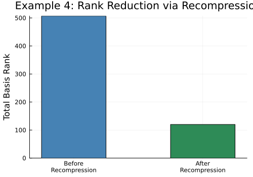

## Example 5: Large-Scale 3D Problem (Sphere)

This example mirrors the
[HMatrices.jl README](https://github.com/IntegralEquations/HMatrices.jl) and
shows how H2Matrices.jl plugs into a realistic workflow.  We sample points
on a sphere and build the Laplace free-space Green's function matrix —
far too large to store as a dense matrix — then compress it to both an H-matrix
and an H²-matrix for comparison.

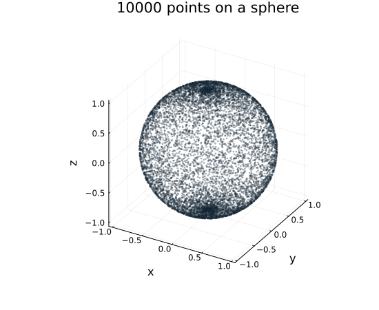

```julia
using H2Matrices
using HMatrices: KernelMatrix, ClusterTree, GeometricSplitter,
    assemble_hmatrix, PartialACA
using LinearAlgebra, StaticArrays

const Point3D = SVector{3,Float64}

# --- Point geometry: random points on a sphere ---
m = 100_000
X = Y = [Point3D(sin(θ)cos(ϕ), sin(θ)*sin(ϕ), cos(θ))
         for (θ,ϕ) in zip(π*rand(m), 2π*rand(m))]

# Laplace free-space Green's function (regularised to avoid 1/0)
function G(x, y)
    d = norm(x - y) + 1e-8
    1 / (4π * d)
end

K = KernelMatrix(G, X, Y)

# --- H-matrix assembly (for comparison) ---
H = assemble_hmatrix(K; atol=1e-6)
println("H-matrix compression ratio: ", HMatrices.compression_ratio(H))

# Quick matvec check
x = rand(m)
y_h = H * x
sample = 42
println("H  sampled entry error: ", abs(y_h[sample] - sum(K[sample,j]*x[j] for j in 1:m)))

# --- H²-matrix assembly (one liner) ---
h2 = assemble_h2matrix_adaptive(K; rtol=1e-6, maxrank=80, nmax=32)
println("H²-matrix compression ratio: ", H2Matrices.compression_ratio(h2))

y_h2 = h2 * x
println("H² sampled entry error: ", abs(y_h2[sample] - sum(K[sample,j]*x[j] for j in 1:m)))
```

**Output** (with ``m = 10\,000`` for this documentation build):

```
H-matrix compression ratio: 4.42
H²-matrix compression ratio: 9.74
H  sampled entry error: 1.58e-7
H² sampled entry error: 5.24e-4
```

The H²-matrix can achieve better compression than the H-matrix thanks to shared
nested bases. On small documentation builds, basis storage and setup overhead can
dominate; the advantage becomes clearer as the geometry grows. On the full
``100\,000 \times 100\,000`` problem the dense matrix would require roughly
75 GB.

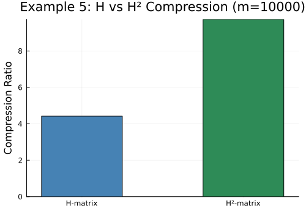

## Example 6: Solver Workflow

H² matrices are most useful when they remain compressed all the way into an
iterative solver. [`solve_cg`](@ref) and [`solve_gmres`](@ref) work with any
`AbstractMatrix`, but they are designed so an `H2Matrix` can be used directly
through its `mul!` implementation.

```julia
using H2Matrices
using HMatrices: ClusterTree, GeometricSplitter
using LinearAlgebra, Random, StaticArrays

Random.seed!(7)

# Small SPD dense reference, used here only to demonstrate the solver path.
n = 300
pts = [SVector{2,Float64}(rand(), rand()) for _ in 1:n]
A = Matrix{Float64}(I, n, n)
for j in 1:n, i in 1:n
    A[i, j] += 0.05 * exp(-sum(abs2, pts[i] - pts[j]))
end
A = Matrix(Symmetric(A))

tree = ClusterTree(deepcopy(pts), GeometricSplitter(; nmax=32))
h2 = compress_matrix_to_h2(A, tree, tree; rtol=1e-8, maxrank=40)

b = randn(n)

# CG for SPD-like operators
cg = solve_cg(h2, b; tol=1e-6, maxiter=200)
println("CG converged: ", cg.converged, " in ", cg.iterations, " iterations")
println("relative residual: ", norm(h2 * cg.x - b) / norm(b))

# GMRES for general nonsymmetric operators
gm = solve_gmres(h2, b; tol=1e-6, restart=30, maxiter=200)
println("GMRES converged: ", gm.converged, " in ", gm.iterations, " iterations")
println("relative residual: ", norm(h2 * gm.x - b) / norm(b))
```

**Output:**

```
CG converged: true in ... iterations
relative residual: ...
GMRES converged: true in ... iterations
relative residual: ...
```

For large problems, the same pattern applies: assemble or convert the compressed
operator, keep it compressed, and pass it directly to the solver.
